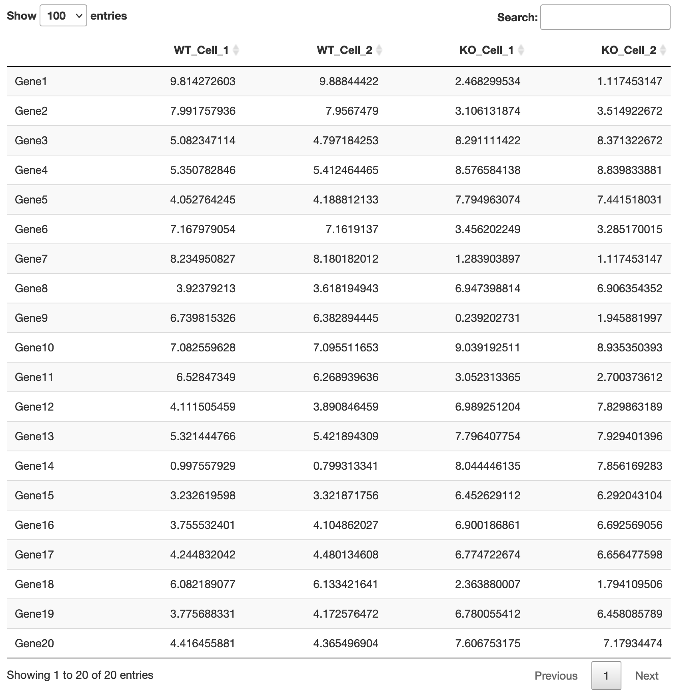
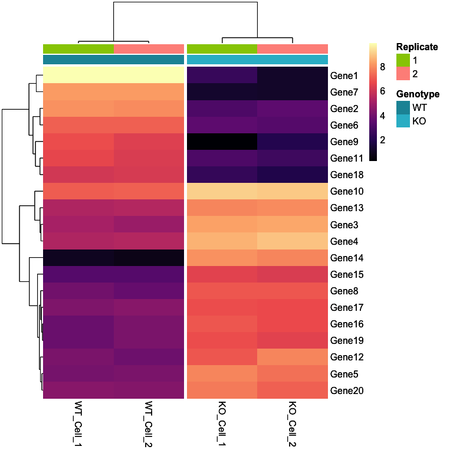
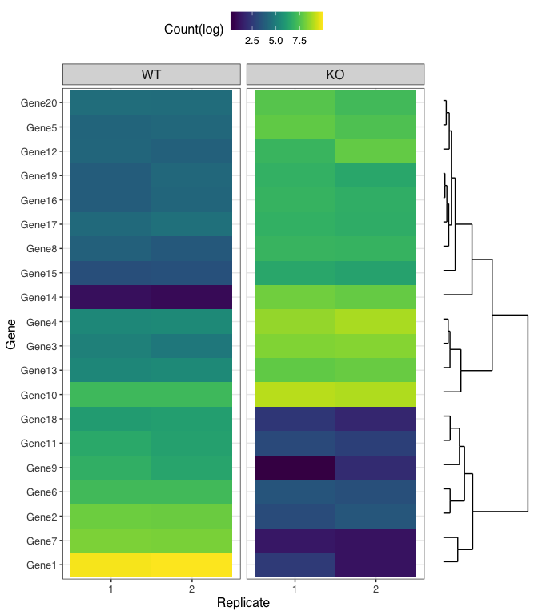

# Heatmap demo 

#### Mira Sohn 
#### 2/5/2022


This workflow is designed to practice data visualization using heatmap based on this tutorial:     https://jcoliver.github.io/learn-r/008-ggplot-dendrograms-and-heatmaps.html    


## Load packages

Links to package manuals:     
    - [ggplot2](https://ggplot2.tidyverse.org/)       
    - [tidyverse](https://www.tidyverse.org/)      
    - [viridis](https://cran.r-project.org/web/packages/viridis/vignettes/intro-to-viridis.html)      
    - [ggdendro](https://cran.r-project.org/web/packages/ggdendro/vignettes/ggdendro.html)      
    - [DT](https://rstudio.github.io/DT/)      


```r
library(ggplot2)   # plotting
library(tidyverse) # data manipulation
library(viridis)   # color palette
library(ggdendro)  # dendrogram
library(DT)        # interative table presentation

set.seed(5678)
```

## Set user variables

User variables include factor levels, color palette, font style/size, and so on. They can be moved to a separate configuration or wrapper file if you prefer to have them externally. I like to minimize hard-coded variables for fine-tuning the plots in the future.


```r
# Set user variables for heatmap
heatmap.font <- 12
heatmap.palette <- colorRampPalette(viridis::magma(7))(100)
user.font <- "Helvetica"
my.genotypes <- c("WT", "KO")


# Define colors for legend
anno.color <- list(Genotype=c(WT="#1b94a5", KO="#2dbace"))

# Ratio between ggplot and dendrogram
gg.dendro.ratio <- c(0.8, 0.2)
```


## Import input

Assume there are 20 top genes found in RNA-seq analysis. Imported data is log-transformed normalized read count table. It's been pre-processed to avoid additional data cleaning steps prior to plotting. 


```r
# Import input data
mtx <- read.csv("test.csv") %>%
  column_to_rownames("X")

# Print the input count matrix
DT::datatable(mtx)
```

<!-- -->

```r
# Build input read count matrix:
# psuedocount + 1 and log-transformation
# conversion is needed for pheatmap() and dist() which only take matrix obj
mtx <- as.matrix(mtx)
```


## Creat heatmap using pheatmap package

pheatmap is one of the most well-known package providing heatmap with dendrogram from hierarchical clustering of genes and samples. 


```r
# Use pheatmap() from pheatmap package

# Build input metadata
heat.meta <- data.frame(Sample=colnames(mtx)) %>%
    separate(col=Sample, c("Genotype", "Celltype", "Replicate"), sep="_", remove=FALSE) %>%
    mutate(Replicate=as.factor(Replicate)) 

rownames(heat.meta) <- heat.meta$Sample

# Update metadata by filtering out any columns having a single factor
col.include <- apply(heat.meta, 2, function(x) { length(unique(x)) }) != 1
heat.meta <- heat.meta[, col.include]

heat.meta$Genotype <- factor(heat.meta$Genotype, levels=c("WT", "KO"))
heatmap1 <-
    pheatmap::pheatmap(mtx,
     show_colnames=TRUE,
     show_rownames=TRUE,
     annotation_col=heat.meta[,colnames(heat.meta) != "Sample"],
     cutree_cols=2,
     border_color=NA,
     color = heatmap.palette,
     annotation_colors=anno.color,
     annotation_names_col=F,
     fontsize=heatmap.font)

heatmap1
```

<!-- -->

## Create heatmap using ggplot2 and ggdendro packages

An important benefit of using ggplot2 is that it provides flexible font selection. Built-in font styles are found here: http://www.cookbook-r.com/Graphs/Fonts. If you're interested in custom font styles, check out font packages such as [extrafont](https://cran.r-project.org/web/packages/extrafont/).


```r
# Use ggplot() from ggplot2 package & ggdendero


# Create dendrogram
dendro <- as.dendrogram(hclust(dist(mtx)))
dendro.plot <- ggdendrogram(dendro,
                            rotate=TRUE) + 
    theme(axis.text.y=element_blank(),
          axis.text.x=element_blank())

# Extract rows (genes) from dendrogram
dendro.order <- order.dendrogram(dendro)


# Clean input data frame
counts.df <- as.data.frame(mtx) %>%
    rownames_to_column(var="Gene") %>%
    gather("Sample", "Count", -Gene) %>%
    mutate(Sample=factor(Sample, levels=colnames(mtx))) %>%
    separate(Sample, c("Genotype", "Celltype", "Replicate"), remove=F) %>%
    mutate(Sample=str_replace_all(Sample, "_", " "),
           Genotype=factor(Genotype, levels=my.genotypes)) %>%
    dplyr::rename(`Count(log)` = Count)


# Set levels of counts.df$Gene to genes ordered in dendrogram
counts.df$Gene <- factor(counts.df$Gene, levels=counts.df$Gene[dendro.order])


# Create heatmap
heatmap2 <-
    ggplot(counts.df,
       aes(x=Replicate, y=Gene, fill=`Count(log)`)) +
geom_tile() +
scale_fill_viridis() +
theme_bw() +
theme(text=element_text(family=user.font, size=heatmap.font),   # family is used to change font style
      legend.position="top",
      legend.title=element_text(size=heatmap.font),
      strip.placement="outside",
      strip.text.x=element_text(size=heatmap.font)) +
facet_grid(~ Genotype, scales="free_x", space="free_x")


# Print the plots
grid::grid.newpage()
print(heatmap2, vp=grid::viewport(x=0.4, y=0.5, width=gg.dendro.ratio[1], height=1))
print(dendro.plot, vp=grid::viewport(x=0.9, y=0.448, width=gg.dendro.ratio[2], height=0.871))
```

<!-- -->

Aligning the two graphs are the hardest part of this workflow. Consult the tutorial introduced above.


## Save the individual output plots

Individual output plots from `pheatmap()`, `ggplot()`, and `ggdendrogram()` are saved using `ggsave()` from the ggplot2 package. Here, I created `heatmap1` from `pheatmap()`, `heatmap2` from `ggplot()`, and `dendro.plot` from `ggdendrogram()`. 


```r
# Save individual plots
ggsave("heatmap1.pdf", heatmap1, device="pdf")  # returns pdf format in my current directory
ggsave("heatmap2.pdf", heatmap2, device="pdf")
ggsave("dendro.pdf", dendro.plot, device="pdf", width=2)  # width=2 is set to limit width of dendrogram
```

## Save the ggplot-ggdendro aligned plot

The aligned plots are saved using `pdf()` and `dev.off()`.


```r
# Save aligned plots
pdf("aligned.heatmap.pdf", fonts=user.font, width=8, height=8)
grid::grid.newpage()
print(heatmap2, vp=grid::viewport(x=0.4, y=0.5, width=gg.dendro.ratio[1], height=1))
print(dendro.plot, vp=grid::viewport(x=0.9, y=0.448, width=gg.dendro.ratio[2], height=0.871))
dev.off()
```

```
## quartz_off_screen 
##                 2
```


## Session info
For reproducibility purposes, here is the output of `sessionInfo()` showing the
versions of all packages used here.


```r
sessionInfo()
```

```
## R version 4.1.0 (2021-05-18)
## Platform: x86_64-apple-darwin17.0 (64-bit)
## Running under: macOS Catalina 10.15.7
## 
## Matrix products: default
## BLAS:   /Library/Frameworks/R.framework/Versions/4.1/Resources/lib/libRblas.dylib
## LAPACK: /Library/Frameworks/R.framework/Versions/4.1/Resources/lib/libRlapack.dylib
## 
## locale:
## [1] en_US.UTF-8/en_US.UTF-8/en_US.UTF-8/C/en_US.UTF-8/en_US.UTF-8
## 
## attached base packages:
## [1] stats     graphics  grDevices utils     datasets  methods   base     
## 
## other attached packages:
##  [1] DT_0.20           ggdendro_0.1.22   viridis_0.6.2     viridisLite_0.4.0
##  [5] forcats_0.5.1     stringr_1.4.0     dplyr_1.0.7       purrr_0.3.4      
##  [9] readr_2.1.1       tidyr_1.1.4       tibble_3.1.6      tidyverse_1.3.1  
## [13] ggplot2_3.3.5    
## 
## loaded via a namespace (and not attached):
##  [1] Rcpp_1.0.7         lubridate_1.8.0    assertthat_0.2.1   digest_0.6.27     
##  [5] utf8_1.2.2         R6_2.5.1           cellranger_1.1.0   backports_1.4.1   
##  [9] reprex_2.0.1       evaluate_0.14      highr_0.9          httr_1.4.2        
## [13] pillar_1.6.4       rlang_0.4.11       readxl_1.3.1       rstudioapi_0.13   
## [17] jquerylib_0.1.4    rmarkdown_2.11     labeling_0.4.2     htmlwidgets_1.5.4 
## [21] pheatmap_1.0.12    munsell_0.5.0      broom_0.7.10       compiler_4.1.0    
## [25] modelr_0.1.8       xfun_0.29          pkgconfig_2.0.3    htmltools_0.5.2   
## [29] tidyselect_1.1.1   gridExtra_2.3      fansi_0.5.0        crayon_1.4.1      
## [33] tzdb_0.2.0         dbplyr_2.1.1       withr_2.4.2        MASS_7.3-54       
## [37] grid_4.1.0         jsonlite_1.7.2     gtable_0.3.0       lifecycle_1.0.0   
## [41] DBI_1.1.1          magrittr_2.0.1     scales_1.1.1       cli_3.1.0         
## [45] stringi_1.7.6      farver_2.1.0       fs_1.5.0           xml2_1.3.3        
## [49] bslib_0.3.0        ellipsis_0.3.2     generics_0.1.1     vctrs_0.3.8       
## [53] RColorBrewer_1.1-2 tools_4.1.0        glue_1.4.2         crosstalk_1.2.0   
## [57] hms_1.1.1          fastmap_1.1.0      yaml_2.2.1         colorspace_2.0-2  
## [61] rvest_1.0.2        knitr_1.37         haven_2.4.3        sass_0.4.0
```


